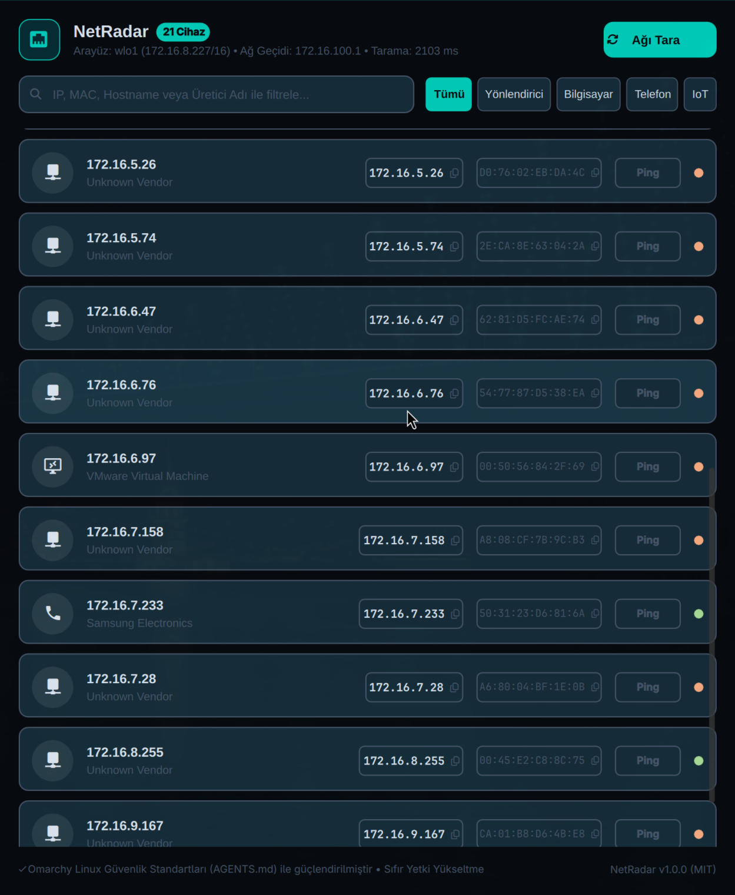
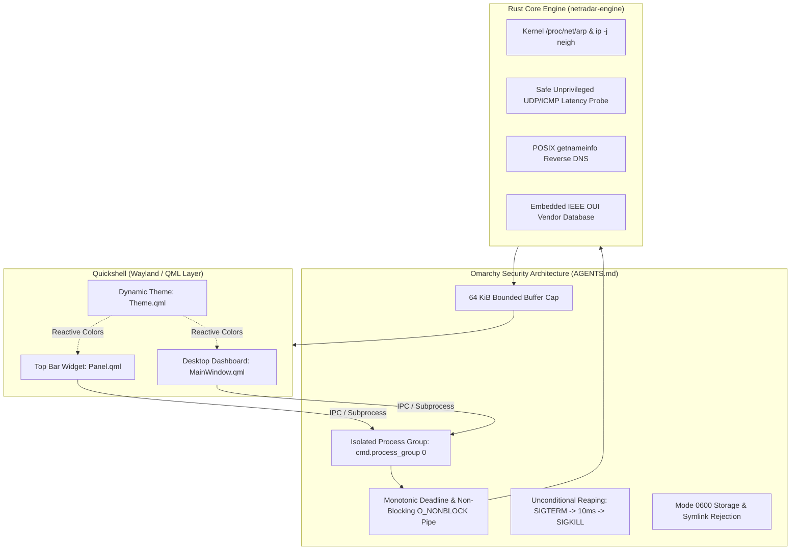

# NetRadar 󰈀

> **Ultra-fast, minimalist, and secure local network scanner & device radar for Omarchy Linux.**

Built natively with **Quickshell (QML)** and a hardened **Rust Engine (`netradar-engine`)**, NetRadar discovers and monitors devices on your local Wi-Fi and Ethernet networks with zero root privileges, instant manufacturer identification, and complete Omarchy dynamic OLED theming.



---

## ✨ Features

- **⚡ Sub-Second Discovery with Zero Root / No Setuid:**
  - Operates completely unprivileged using Linux `/proc/net/arp`, non-blocking kernel neighbor discovery (`ip -j neigh`), and safe mDNS / reverse DNS resolution.
  - No dangerous raw packet drivers or elevated setuid binaries.
- **🏷️ Instant Hardware Manufacturer (OUI) Identification:**
  - Embedded high-speed MAC prefix lookup table.
  - Automatically identifies and categorizes devices: Apple, Samsung, Intel, Google, Xiaomi, Huawei, Amazon, Raspberry Pi, Espressif (IoT), TP-Link, MikroTik, Cisco, VMware, etc.
- **🎨 100% Omarchy Dynamic Theme Awareness:**
  - Automatically reacts to active Omarchy system themes (`~/.local/state/omarchy/current/theme`).
  - High-contrast OLED dark background with vibrant neon cyan (`#00e5ff`) and status accents.
- **📋 1-Click Clipboard Copy:**
  - Dedicated copy pills for IP and MAC hardware addresses with instant Wayland visual toast feedback.
- **⏱️ Live Latency (Ping) Probes:**
  - Measures millisecond round-trip time with green/amber reachability status dots.
- **🔍 Instant Filter & Search:**
  - Real-time search across IP, MAC, hostname, manufacturer name, or custom device nicknames.
  - Filter chips: All, Routers, Computers, Phones, IoT.
- **🛡️ Dual Mode Operation:**
  - **Quickshell Top Bar Widget (`Panel.qml`)**: Compact radar dropdown integrated into Omarchy's top bar with active device counter badge.
  - **Standalone Desktop Application (`netradar`, `shell.qml`)**: Spacious dashboard with category filters and full diagnostic views.

---

## 🏛️ System Architecture



---

## 🔒 Security Compliance (AGENTS.md)

NetRadar is engineered from the ground up to satisfy all strict Omarchy Linux Application, Engine & Plugin Security Architecture Standards:

1. **Subprocess Group Isolation:** All helper commands execute with `cmd.process_group(0)` in their own independent process group.
2. **Monotonic Deadlines & Non-Blocking I/O:** Pipe file descriptors are placed in `O_NONBLOCK` mode and polled using monotonic clocks (`Instant::now() >= deadline`). Even if background child processes refuse to close pipes, the deadline terminates execution safely.
3. **Unconditional Reaping (`SIGTERM` -> `SIGKILL`):** When timeouts or cancellations occur, the entire process group is signaled with `SIGTERM`, granted a 10ms grace period, and unconditionally terminated with `SIGKILL`.
4. **Plain Text Rendering (`Text.PlainText`):** All dynamic strings (IPs, MACs, hostnames, vendors) in QML explicitly use `textFormat: Text.PlainText` to eliminate HTML/script injection risks.
5. **Mode 0600 Persistence:** Device aliases and configuration in `~/.local/state/omarchy/netradar/devices.json` are written atomically via temp files, rejecting any symlinks.

---

## 🚀 Installation

### Building from Source

```bash
# Clone the repository
git clone https://github.com/ozdil/omarchy-netradar.git
cd omarchy-netradar

# Build release binary
cargo build --release --locked

# Install binaries and desktop launcher to ~/.local/bin
install -m 755 target/release/netradar-engine ~/.local/bin/
install -m 755 netradar ~/.local/bin/
install -m 755 netradar-dashboard ~/.local/bin/
install -m 755 netradar-status ~/.local/bin/
install -m 644 netradar.desktop ~/.local/share/applications/
```

### Arch Linux / Omarchy (PKGBUILD)

```bash
makepkg -si
```

---

## ⌨️ CLI Usage

```bash
# Full JSON scan output (for scripts and integrations)
netradar-engine --scan

# Single-line human readable status
netradar-status
# Output: 󰈀 NetRadar: 21 devices on wlo1 (172.16.8.227/16) • GW: 172.16.100.1

# Ping a specific IP
netradar-engine --ping 172.16.100.1

# Assign a custom nickname to a device
netradar-engine --set-alias "AC:71:2E:95:48:56" "Ana Ofis Router"

# Launch GUI Dashboard
netradar
```

---

## 📄 License

MIT License © 2026 Ozan Özdil.
